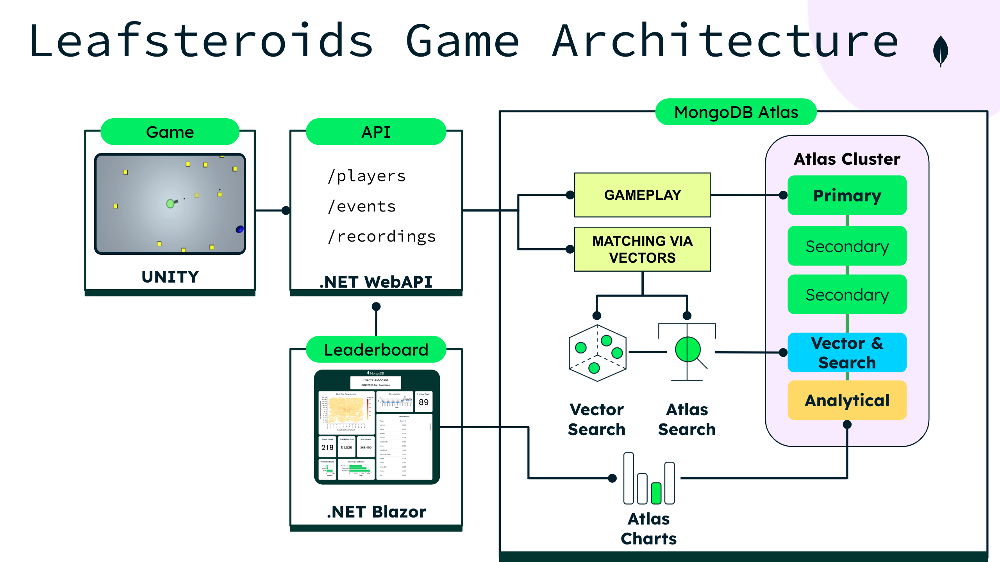

# Leafsteroids

This repository contains the MongoDB `Leafsteroids` demo. A game developed by the MongoDB team, featuring a 2D arcade-style space shooter. Built with Unity3D and .NET, it includes a game client, an ASP.NET Web API, and a website using Blazor pages. Players aim to destroy bricks (asteroids) and achieve the highest score within 60 seconds by collecting power-ups and destroying targets quickly, while competing against each other within the concept of an event (tournament). The backend uses MongoDB Atlas for data storage, including Atlas Vector Search to match players based on gameplay style, score, and speed. The game is playable on tablets, mobiles, and desktop/laptop, with real-time scoreboards for competitive play.

Follow the instructions in this README to run a clone of your own to get your MongoDB development jump started.

You can also register and create your own event to share with your friends and play live anywhere [here](https://leafsteroids.net/).

## Architecture



The demo and repository consist of the following parts:

- Game Client (Unity3D, .NET, C#)
- Game Server (ASP.NET Web API, .NET, C#)
- Website (Blazor Server Application, .NET, C#)

## Running your own clone

### Requirements

- [Install the .NET SDK 7](https://dotnet.microsoft.com/en-us/download/dotnet/7.0)

### Prepare the database (MongoDB Atlas)

- [Create a new Atlas project](https://www.mongodb.com/cloud/atlas/register)
- [Create a new cluster (M0)](https://www.mongodb.com/docs/atlas/tutorial/deploy-free-tier-cluster/)
- [Create a new database](https://www.mongodb.com/basics/create-database) `Leafsteroids`:
    - Create a collection `config` and add
      the [`deployment/templates/config.template`](https://github.com/mongodb-developer/leafsteroids/blob/main/deployment/templates/config.template)
      document to it.
    - Create a collection `events` and add
      the [`deployment/templates/event.template`](https://github.com/mongodb-developer/leafsteroids/blob/main/deployment/templates/event.template)
      document to it.

You can adjust the config to change how the game behaves and add more events to have several to choose from.  
To get started, it is recommended to use those default documents.

### Run locally over HTTP (no TLS certificates)

Stay on HTTP for laptop development. Production TLS lives on AWS ACM / load balancers, not in these apps. Do **not** use `--launch-profile https` locally (`dotnet dev-certs` only covers `localhost`, not LAN IPs or port 443).

### Run the REST service

- Switch into the `rest_service` folder.
- Make a copy of the `.env.template` file and call it `.env`.
- [Grab the connection string for your Atlas cluster](https://www.mongodb.com/docs/guides/atlas/connection-string/) (or use a local MongoDB URI such as `mongodb://127.0.0.1:27017`) and
  exchange it in the `.env` file in the `rest_service` folder.
- Also replace the `DATABASE_NAME` in the `.env` file with the database name you created earlier.

```shell
dotnet run --launch-profile http --urls "http://127.0.0.1:8000"
```

Open http://127.0.0.1:8000/ to verify the REST service is running.

### Run the Website

- Switch into the `website` folder.
- Make a copy of the `.env.template` file and call it `.env`.
- Set `REST_SERVICE_IP=127.0.0.1`, `REST_SERVICE_PORT=8000`, and `GAME_CLIENT_PORT=8000` so the Unity WebGL client calls the local API over HTTP. The website talks to the REST service only; it does not need `CONNECTION_STRING`.
- Atlas Charts IDs can be left empty; dashboards will be blank.

```shell
dotnet run --launch-profile http --urls "http://127.0.0.1:8001"
```

Open http://127.0.0.1:8001/ to verify the website is running.

To play in the browser, open `http://127.0.0.1:8001/EventRegister?EventId=<your events._id>`, register or log in, then click **Play Now**. Do not open `/player.html` directly; the game reads API host/port from `localStorage` set on that page.

### Run the Game Client

- Switch into the `game_client` folder.
- In the `Assets` folder, make a copy of the `.env.template` file and call it `.env`.
- Adjust the REST_SERVICE_IP in the `.env` folder to your `rest_service`. Leave as is when running locally.
- Adjust the EVENT_ID to the event you want to use (from the `events` collection).
- Adjust the WEBSITE_URL to your local website with port (don't add a trailing `/`).
- Run the game.

## Contributors

- [Sig Narváez](https://www.linkedin.com/in/signarvaez/)
- [Carlos Castro](https://www.linkedin.com/in/carloscastromdb/)
- [Ángel Martínez](https://www.linkedin.com/in/amartinezgonzalez/)
- [Hubert Nguyen](https://www.linkedin.com/in/hubertnguyen/)
- [Nic Raboy](https://www.nraboy.com)
- [Dominic Frei](https://linktr.ee/dominicfrei)